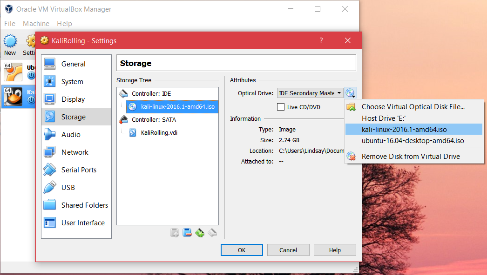
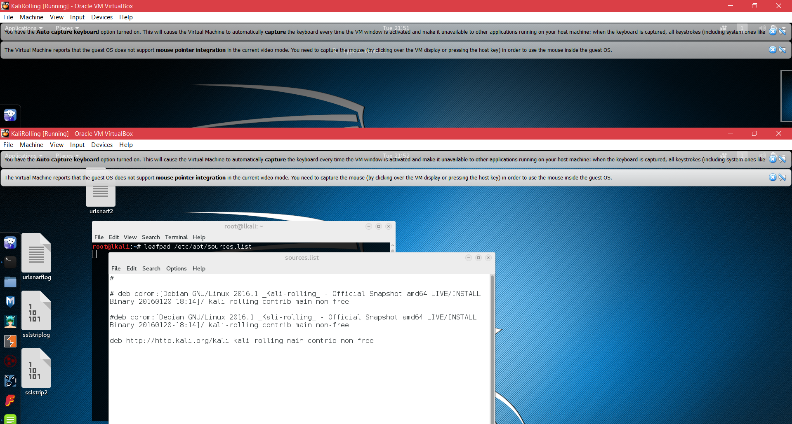

Getting Virtualbox Set Up
=========================

Install VirtualBox
------------------
Head over to `VirtualBox.org <https://www.virtualbox.org/>`_ and download VirtualBox and install it.

Making Virtual Machines
--------------------------
.. note::
   Instead of making a VM, you could also directly download a kali VM from Kali's site instead.

**Tips:**

* I give at least 15GB to each VM as a general rule, dynamically allocated ("thin provision" in VMWare) so that it doesn't immediately use 15GB of space on disk.
* Kali needs at least 10GB in my experience to succeed installation. 
* Give it enough RAM--I usually do 2GB, but do what your system can handle.

Make new machine
++++++++++++++++
Click new > VM, follow steps.

Stick .iso in machine
+++++++++++++++++++++
You haven't done anything but create a shell for a virtual machine; you have to actually give it an operating system to boot. Once you make new machine, stick an iso in it like so:

Installing Guest Additions
--------------------------

These aren't necessary to get a box going, but guest additions for VirtualBox make the experience so much better. It allows you to go to fullsize, drag-and-drop between host and guest machines, share clipboards, and share folders between guest and host.

Doing this in Kali and Ubuntu or any other system will be different--Kali actually has its own guest additions in its repositories.

Kali
++++

.. note::
   Kali's guest additions are actually added from Kali's own repos. Linux uses the concept of "repositories" to get updates by adding links to repositories in a file under /etc, specifically /etc/apt/sources.list, that Linux will read and pull packages from. It would be almost like keeping a file under C:/Windows/System32 that tells the system where the Microsoft servers are, but you can also add your own repositories as well and people often do for projects. 

In Kali, you actually have to add repositories to the sources.list because for some reason the .iso from the site doesn't build this in. Instructions can be found at `Kali's site <http://docs.kali.org/general-use/kali-linux-sources-list-repositories>`_. Instructions on their site for installing guest additions are `here <http://docs.kali.org/general-use/kali-linux-virtual-box-guest>`_ or below.

Add this line to /etc/apt/sources.list by doing the following:

.. code-block:: console

   # echo /etc/apt/sources.list >> deb http://http.kali.org/kali kali-rolling main contrib non-free
   # apt-get update
   # apt-get install -y virtualbox-guest-x11
   # reboot

Your sources.list should look like this:

Ubuntu
++++++
From the VirtualBox menu when the VM is booted, click Devices > insert Guest Additions CD. VBox will do the rest for you. If not, consult YouTube.

.. figure::  images/ga.png
   :align:   center
